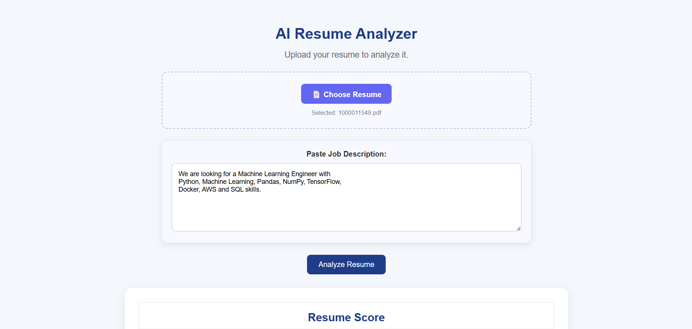
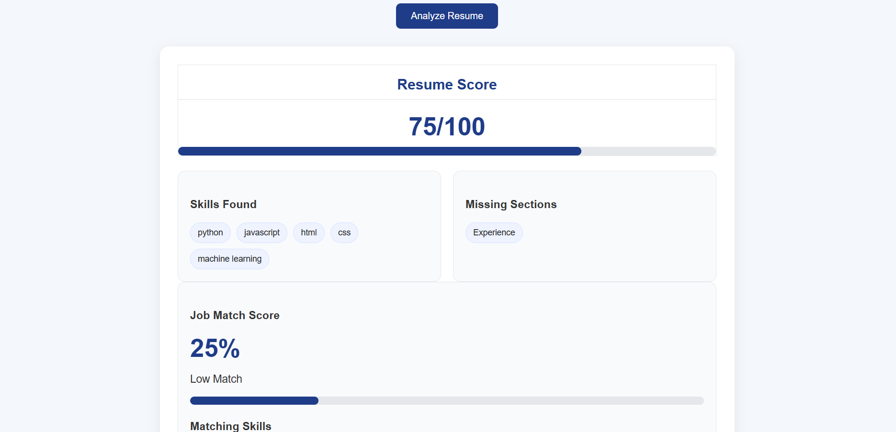
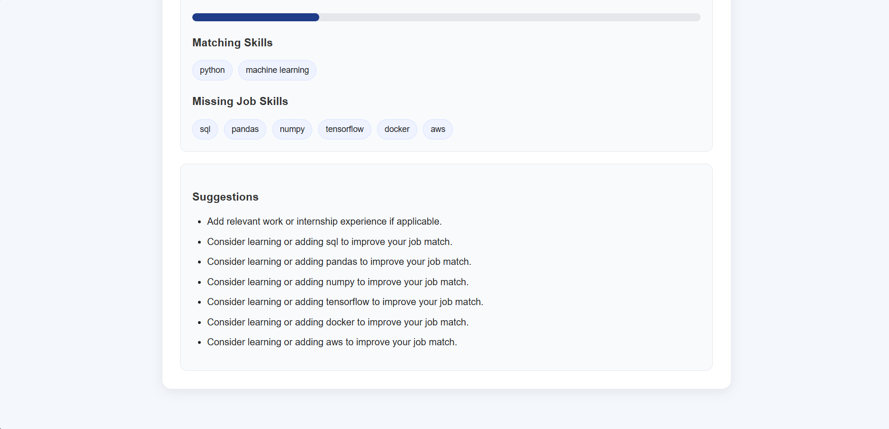

# AI Resume Analyzer

An AI-powered Resume Analyzer built using Python, FastAPI, HTML, CSS, and JavaScript.

## Features

- Upload resumes in PDF, JPG, JPEG, and PNG formats
- Extract text from PDF resumes
- OCR support for image-based resumes
- Detect important resume sections
- Identify technical skills
- Generate a resume score
- Compare resume skills with a job description
- Show matching skills
- Show missing job skills
- Provide improvement suggestions

## Tech Stack

### Backend
- Python
- FastAPI
- PyPDF
- Pytesseract
- pdf2image
- Pillow

### Frontend
- HTML
- CSS
- JavaScript

## How It Works

1. Upload your resume.
2. Paste a job description.
3. Click **Analyze Resume**.
4. The application extracts resume information.
5. It compares resume skills with the job requirements.
6. It displays the resume score, matching skills, missing skills, and suggestions.

## Run Locally

Activate the virtual environment:

```powershell
.\venv\Scripts\Activate.ps1
```

Start the FastAPI backend:

```bash
uvicorn main:app --reload
```

Then open the frontend using Live Server.

## Project Status

The project currently supports resume analysis, job-description matching, PDF/image processing, scoring, and improvement suggestions.

## Future Improvements

- AI-generated resume feedback
- Better skill extraction
- Improved scoring algorithm


## 📸 Screenshots

### Home Page


### Resume Analysis


### Detailed Results
